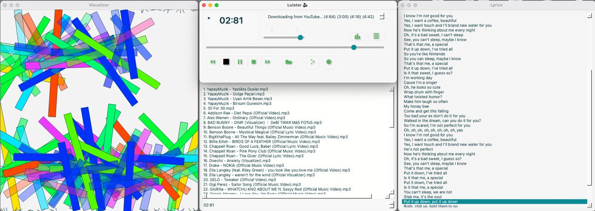

<center></center>

# Luister

A modern, Python-powered media player inspired by the classics.

---

## Contents

- [Info](#info)  
  Information about the libraries and tools used.
- [Luister Features](#luister-features)  
  Explore the functionality and user experience.
- [Get Started](#get-started)  
  How to clone, set up, and run Luister on your computer.

---

## <a name="info"></a>Info

**Luister** is built using the following technologies:

- **PyQt5**: A powerful set of Python bindings for the Qt application framework, allowing for the creation of modern, cross-platform GUIs.
- **pyqt5-tools**: Provides essential developer tools like Qt Designer, which are not bundled with the main PyQt5 package.

---

## <a name="luister-features"></a>Luister Features

<center></center>

Luister brings the spirit of classic media players into the Python era, with a sleek interface and all the features you expect:

- **Playlist Management:**  
  Easily add your favorite songs to the playlist. If the playlist is empty, playback controls are disabled to keep things tidy.

- **Simple Song Selection:**  
  Click the 'arrow up' button to open a file dialog. Select your music files (hold Ctrl to select multiple), and hit 'Open'. The playlist window will appear automatically.

- **Intuitive Controls:**  
  Once your playlist is loaded, all controls become active.

- **Now Playing Display:**  
  The left LCD shows the current time; the right displays the song title and duration.

- **Time & Volume Sliders:**  
  Adjust playback position and volume on the fly.

- **Shuffle & Loop:**  
  - Shuffle: Randomizes your playlist order for a fresh experience.
  - Loop: Repeats the playlist when it ends.

- **Direct Song Selection:**  
  Click any song in the playlist to play it instantly.

- **Flexible Windows:**  
  The main player and playlist window can be used independently—close one and keep the other open!

---

## <a name="get-started"></a>Get Started

Ready to try Luister? Just follow these steps:

### 1. Clone the Repository

Open your terminal and run:

```
git clone https://github.com/codesapienbe/luister
cd luister
```

### 2. Run the App

```
uvx run --from https://github.com/codesapienbe/luister/releases/download/v2025.07.06.1321/luister-0.1.0-py3-none-any.whl
```

No extra commands needed! The app will launch, and you can start enjoying your music right away.

---

<center>
  <h2>Enjoy Luister!</h2>
  <p style="font-size:100px">&#129409;</p>
</center>

**Tip:** If you have any questions or want to contribute, check out the repository’s README or open an issue on GitHub.

>> **Happy listening!**

